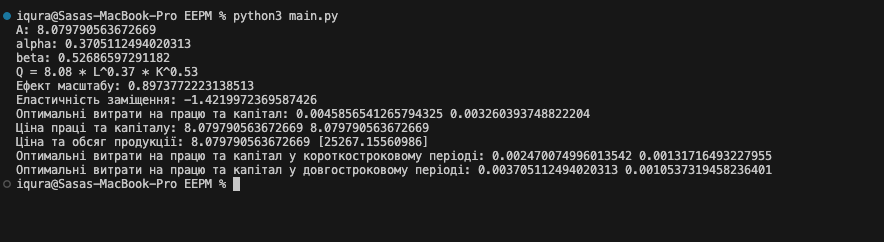

## Звіт

У рамках цього завдання було проведено аналіз даних та розраховані різні показники, що характеризують взаємозв'язок між витратами виробничих факторів та обсягом продукції. Для реалізації використовувалися наступні кроки та методи:

### 1. Завантаження та підготовка даних
Були надані дані про витрати виробничих факторів (K, L) та обсяг продукції (Q). Ці дані були використані для побудови моделі лінійної регресії.

### 2. Побудова моделі лінійної регресії
Використовуючи бібліотеку `scikit-learn`, була побудована лінійна регресія для апроксимації залежності між логарифмами витрат виробничих факторів та логарифмом обсягу продукції.

### 3. Розрахунок параметрів регресії
Були розраховані параметри регресії \( A \), \( alpha \) та \( beta \), які визначаються за допомогою лінійної регресії.

### 4. Аналіз параметрів регресії
Були обчислені та виведені на екран ефект масштабу та еластичність заміщення для оцінки впливу виробничого масштабу та заміщення факторів виробництва.

### 5. Розрахунок оптимальних витрат виробничих факторів
Для короткострокового та довгострокового періодів були розраховані оптимальні витрати виробничих факторів, використовуючи метод множників Лагранжа.

### Результати:
1. **Параметри регресії:**
   - \( A \): 8.08
   - \( alpha \): 0.37
   - \( beta \): 0.53
   - Функція продукції: \( Q = 8.08 * L^{0.37} * K^{0.53} \)
   - Ефект масштабу: 0.90
   - Еластичність заміщення: -1.42

2. **Оптимальні витрати на працю та капітал:**
   - **Короткостроковий період:**
     - Пропорція витрат на працю: 0.0025
     - Пропорція витрат на капітал: 0.0013
   - **Довгостроковий період:**
     - Пропорція витрат на працю: 0.0037
     - Пропорція витрат на капітал: 0.0011

3. **Ціни праці та капіталу:**
   - Ціна праці: 8.08
   - Ціна капіталу: 8.08

4. **Ціна та обсяг продукції:**
   - Ціна продукції: 8.08
   - Обсяг продукції: 25267.16

